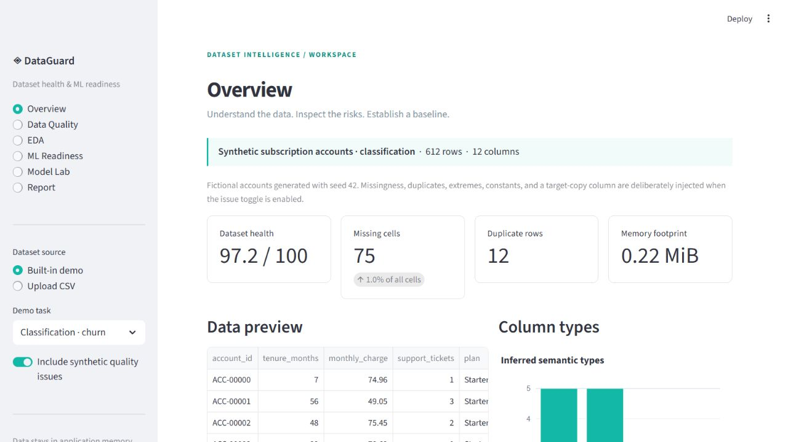

# DataGuard

**Automated Dataset Health & Machine Learning Readiness Analyzer**

[](https://github.com/igc27/DataGuard/actions/workflows/ci.yml)

DataGuard turns a CSV into an evidence-based dataset review: what is missing,
what looks suspicious, what needs preprocessing, and how sensible ML baselines
perform. It combines an explainable quality audit with reproducible scikit-learn
pipelines in a focused Streamlit workspace.

Built for practical dataset triage: every score has a breakdown, every leakage
warning is qualified, and every reported model metric comes from an actual holdout.



Actual application capture using the built-in synthetic demo.

## What you can do

- Upload CSVs with encoding/delimiter controls or explore two built-in synthetic demos.
- Inspect structure, semantic types, missingness, duplicates, infinities, skewness,
  zero-heavy features, constants, cardinality, and possible identifiers.
- Explore interactive distributions, IQR candidates, and bounded correlation maps.
- Select a target, confirm classification or regression, and review preparation
  recommendations, imbalance, and conservative leakage clues.
- Compare logistic/Ridge, random forest, and extra trees against a dummy control.
- Inspect held-out macro classification metrics, regression errors, confusion
  matrices, training feature exclusions, and permutation importance.
- Download a standalone HTML report with embedded interactive charts and methodology.

## Run locally

Python **3.11–3.13** is supported. Python 3.12 is the reference environment.
No API key, cloud account, or dataset download is required.

```bash
git clone https://github.com/igc27/DataGuard.git
cd DataGuard
python -m venv .venv
```

Activate the environment:

```bash
# Windows PowerShell
.venv\Scripts\Activate.ps1

# macOS / Linux
source .venv/bin/activate
```

Install the verified dependencies and editable package, then launch:

```bash
python -m pip install -r requirements-lock.txt
python -m pip install --no-deps -e .
python -m streamlit run app/streamlit_app.py
```

For a lighter application-only installation, `python -m pip install -r requirements.txt`
installs application dependencies at the verified pins. The lock includes development
tools for reproduction and CI. Run all commands from the repository root.

## Example workflow

1. Launch the app; the classification demo opens immediately.
2. Inspect the overview and quality audit. The issue toggle explains which
   problems were deliberately introduced into the synthetic data.
3. Explore `monthly_charge` and the numeric correlation map.
4. Review the `churn` target under ML Readiness, including its exact-copy clue.
5. Open Model Lab and run baseline comparison. Inspect the training audit,
   macro F1 ranking, dummy control, confusion matrix, and permutation importance.
6. Download the HTML report under Report; it opens offline.
7. Switch to the regression demo to compare RMSE, MAE, and R², or upload your CSV.

## Architecture

```text
CSV / demo → profiling → quality findings + health score
                     ↘ target inference + readiness + leakage review
Data copy → split → training feature audit → Pipeline → holdout metrics
                                                      ↘ permutation importance
                    Streamlit workspace → standalone HTML report
```

The UI is an orchestration layer. Profiling, scoring, preprocessing, modeling,
evaluation, reports, and charts are importable modules with independent tests.
See [architecture](docs/architecture.md) for resource limits and design choices.

## Transparent scoring

**Dataset health** is 100 minus weighted observed rates:

| Factor | Maximum penalty |
|---|---:|
| Missing cells | 35 |
| Duplicate rows | 20 |
| Infinite numeric cells | 15 |
| Constant / empty columns | 10 |
| Near-constant columns | 5 |
| Possible identifiers | 5 |
| High-cardinality categories | 5 |
| Possible mixed numeric types | 5 |

Each penalty is `maximum × affected rate`, using cell, row, or column denominators
as appropriate. For example, 10% missing cells cost 3.5 points. Outliers and
correlation are diagnostics and carry no automatic penalty.

**ML readiness** uses target-aware factors: feature missingness (20), infinities
(10), unusable/ID/datetime features (15), high cardinality (10), unusable target
rows (15), imbalance (15), and leakage clues (15). Unsupported or ambiguous tasks
receive 0 with an explicit validity reason. The app shows the full arithmetic.

These are transparent triage rubrics, not statistically calibrated probabilities
or guarantees. Read [scoring](docs/scoring.md) for exact formulas, overlap rules,
validity gates, and limitations.

## ML methodology

- Split **before fitting** imputers, scalers, and category vocabularies.
- Stratified 75/25 classification holdout; seeded regression holdout. Identical
  original predictor records stay together through grouped splitting.
- Audit training predictors only, excluding constants, all-missing columns,
  ID candidates, datetime, high-cardinality categories, and exact target copies.
- Numerical median imputation and scaling; categorical mode imputation and
  bounded one-hot encoding that handles unseen categories.
- Three learned baselines plus a dummy reference. Classifier weights are balanced.
- Classification ranks by **macro F1**, with balanced accuracy, macro precision/
  recall, accuracy, and valid ROC-AUC. Regression ranks by **RMSE**, with MAE and R².
- Permutation importance uses held-out original columns, up to 250 rows,
  three repeats, and the task's ranking score.

Task inference recognizes low-cardinality class labels and continuous numerical
outcomes, with explicit overrides for ambiguous targets. One-class, tiny,
singleton-class, datetime, and excessive-cardinality targets fail clearly.
See [methodology](docs/methodology.md) for definitions and interpretation.

## Testing and quality

```bash
python -m ruff check .
python -m ruff format --check .
python -m pytest --cov=dataguard --cov-report=term-missing --cov-fail-under=80
python -m build
python -m pip check
```

Tests cover ingestion, measured profiling and scoring, task inference, missing
and infinite values, IQR edge cases, cardinality, train-only imputation, unseen
categories, duplicate grouping, binary/multiclass classification, regression,
input preservation, report escaping, charts, and Streamlit views/training.
GitHub Actions runs lint, formatting, tests, coverage, packaging, and dependency
checks on Python 3.11, 3.12, and 3.13.

## Project structure

```text
app/streamlit_app.py       # Six-section dashboard
src/dataguard/
  ingestion.py            # Bounded CSV loading
  profiling.py            # Semantic types, statistics, correlations
  quality.py              # Findings and dataset health
  readiness.py            # Problem inference and ML readiness
  preprocessing.py        # Training audit and ColumnTransformer
  modeling.py             # Baseline pipelines and explainability
  evaluation.py           # Task-appropriate metrics
  visualization.py        # Reusable Plotly charts
  reporting.py            # Escaped offline HTML report
  demo.py                 # Deterministic synthetic data
tests/                    # Core and UI integration tests
sample_data/              # Redistributable demo CSVs and provenance
scripts/                  # Reproduction helpers
docs/                     # Architecture, methodology, scoring, deployment
.github/workflows/ci.yml   # Linux / three Python versions
```

## Privacy

DataGuard makes no external AI calls, sends no dataset analytics, and does not
persist uploaded files. Streamlit usage statistics are disabled. The original
data remains unchanged and analysis results are kept in the current app session.

On your machine, analysis runs locally. On a hosted instance, your upload is
sent to and processed on that server. Reports exclude raw records but contain
column names, class labels, and aggregate statistics; review before sharing.
Use non-sensitive data in any public demo.

## Data and licensing

Both demos are wholly synthetic, generated with NumPy and seed 42, and released
under this repository's MIT license. They contain no real customer records or
third-party dataset assets. Injected quality issues are documented in
[sample provenance](sample_data/README.md). Regenerate CSVs with
`python scripts/generate_samples.py`.

## Practical limits

- CSV only; 25 MiB, 100,000 rows, 200 columns.
- Correlation: first 40 numeric columns, at most 10,000 seeded rows.
- Baselines: at most 5,000 sampled rows, 80 retained features, 30 encoded
  categories per categorical predictor, and 20 target classes.
- Heuristics can miss nonlinear leakage and incorrectly flag legitimate IDs,
  dates, or mixed types. Provenance and prediction-time availability need review.
- Identical original rows are grouped; domain entities and temporal dependence
  require a custom split. This is not a time-series or multilabel analyzer.
- Scores are a documented rubric, not calibrated measures of predictive value.
- Single-holdout ranking and importance are exploratory. No tuning, independent
  final test set, causal claims, fairness certification, or production suitability
  is implied. Negative and unstable importance values are possible.

## Deployment and roadmap

Streamlit Community Cloud can host the Python app for free when account access
permits. See [deployment configuration](docs/deployment.md). A GitHub Pages site
alone cannot run this application. No deployment is represented as live until verified.

Future work: domain-aware group and temporal splits, repeated/cross-validated
comparison, explicit semantic schema controls, calibrated score research, and
Parquet support. These are planned, not v1.0.0 features.

## Technology stack

Python · pandas · NumPy · scikit-learn · Streamlit · Plotly · pytest · Ruff ·
GitHub Actions · Hatchling

## Author

**Mohammed Alanazi**. Built with AI-assisted engineering; functionality is
documented and tested, without claims of manual-only authorship or fabricated
professional experience.

## License

[MIT](LICENSE) — Copyright (c) 2026 Mohammed Alanazi.
