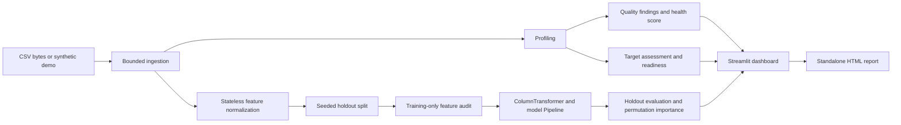

# Architecture and engineering choices

DataGuard separates presentation from analysis so its diagnostics and pipelines
can be used and tested without running Streamlit.

## Boundaries

`ingestion.py` accepts CSV bytes and raises actionable `DatasetError`s.
`profiling.py` produces a typed `Profile` with measured column statistics and
bounded pairwise analysis. `quality.py` turns these measurements into findings
and additive penalties. `readiness.py` infers a task and produces target-aware
diagnostics. `preprocessing.py`, `modeling.py`, and `evaluation.py` own train-fitted
transformations, holdout construction, models, and metrics. `visualization.py`
and `reporting.py` consume analysis results. `app/streamlit_app.py` orchestrates
the workflow, input controls, navigation, and session state.

## Resource choices

CSV input is bounded to 25 MiB, 100,000 rows, and 200 columns. Parsing checks
header integrity before pandas can silently rename duplicate headers. Dates
are detected semantically but left unchanged. Ingestion offers encoding and
delimiter overrides because inference is fallible.

Univariate profiling uses every loaded row. Correlation uses at most the first
40 numeric columns and 10,000 seeded rows. Column duplication uses hashes to
find candidates and equality to confirm them. Baseline training uses at most
5,000 rows, 80 retained predictors, and 30 encoded categories per categorical
feature. The maximum dense encoded feature matrix is therefore bounded near
5,000 × 2,400 values. Forests use 100 trees, capped depth, and one worker to avoid
oversubscribing a small hosted process. These limits prioritize responsive
exploration; they are not big-data infrastructure.

## Privacy and session state

Uploaded datasets are held in application memory and are never written to disk
by DataGuard. Analysis is stored in the current Streamlit session, rather than
a shared global data cache. The original uploaded dataframe is not mutated.
Changing dataset, target, problem type, or model exclusions invalidates
incompatible model results. No analytics, external AI calls, or dataset telemetry
are implemented; Streamlit usage statistics are disabled.

On localhost, computation runs on the user's machine. When hosted, uploads are
sent to that deployment server; “local analysis” does not mean browser-only
processing. A public demo is not a secure enterprise dataset service. Downloaded
reports omit raw records but retain column/class labels and aggregate statistics.

## Reproducibility

Seed 42 controls synthetic generation, row sampling, splits, and ensemble models.
The dependency lock records the verified environment; the package metadata also
provides maintainable major-version bounds. CI covers Python 3.11–3.13 on Linux.
Times are measured at runtime and will differ by machine. This initial release
does not persist fitted models or claim production model registry support.
